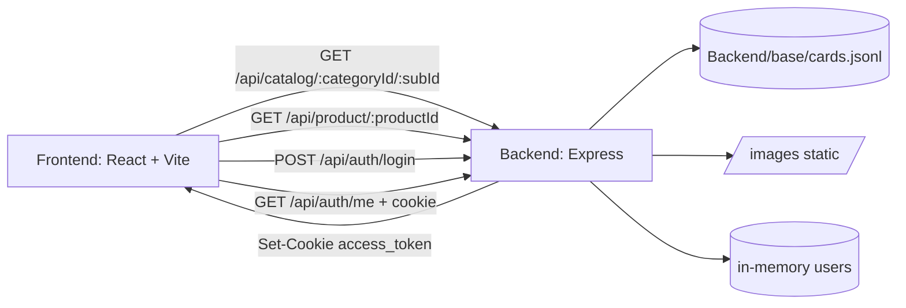
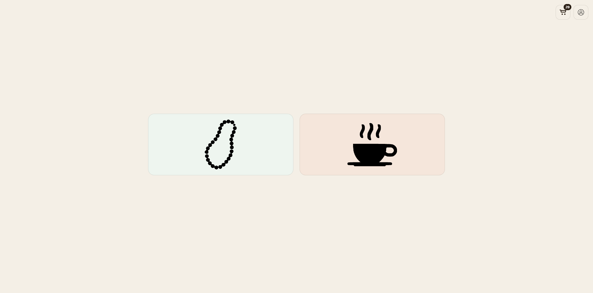
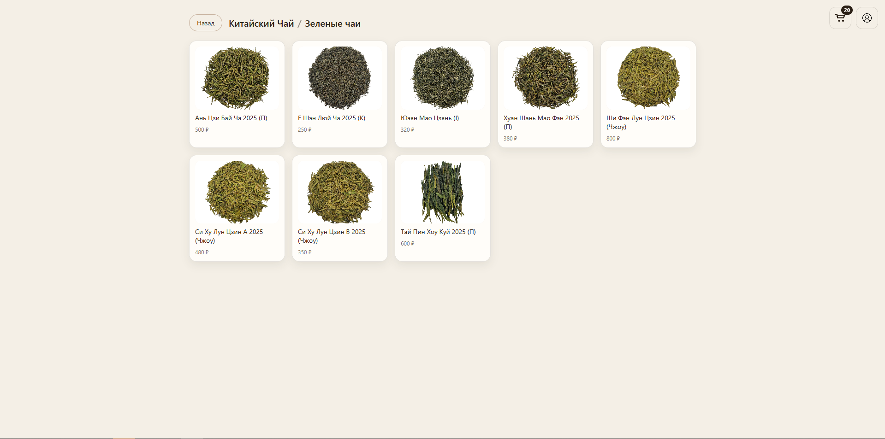
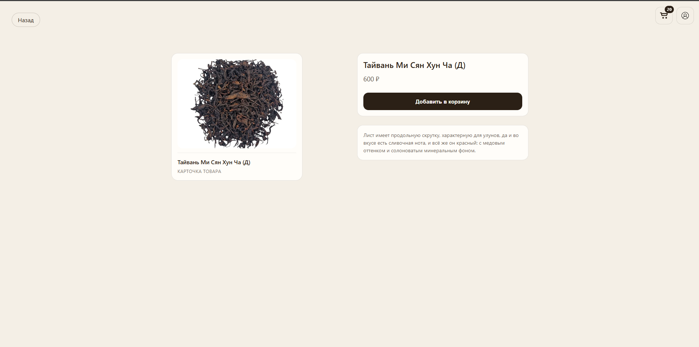
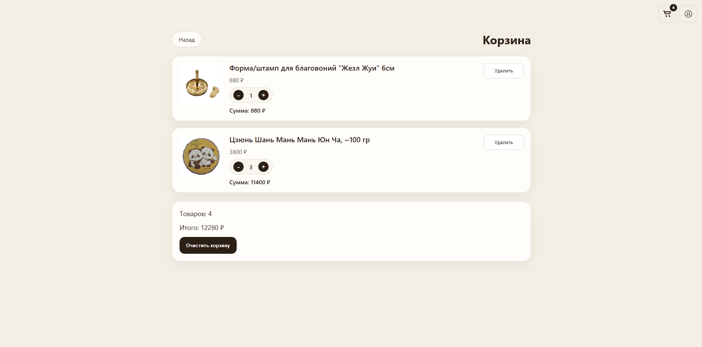

# 🍵 Tea Project

Интернет-магазин чая и чайной посуды с каталогом, карточками товаров, корзиной и ролевым доступом в админ-зону.

## ✨ Что уже реализовано

- 🫖 Каталог по категориям и подкатегориям (`tea` и `wares`)
- 🧾 Страница товара с загрузкой по `productId`
- 🛒 Корзина с хранением в `localStorage`
- 🔐 Авторизация через JWT в `httpOnly` cookie
- 🛡️ Защита маршрута `/admin` по permission `admin:enter`
- 🖼️ Раздача изображений с бэкенда через `/images`

## 🧱 Архитектура



### Поток данных

1. Пользователь открывает каталог на фронтенде (`React Router`).
2. Фронтенд запрашивает данные у Express API (`/api/catalog/...`, `/api/product/...`).
3. Бэкенд читает товары из `Backend/base/cards.jsonl`, мапит категории и отдает JSON.
4. Картинки подтягиваются по URL с `http://localhost:5000/images/...`.
5. Корзина полностью управляется во фронтенде через `CartContext` и сохраняется в `localStorage`.
6. Логин выдает JWT в cookie, а `RequirePermission` ограничивает доступ в админку.

## 🗂️ Структура проекта

```text
TEA/
├─ Backend/
│  ├─ base/cards.jsonl           # источник карточек товаров
│  ├─ index.js                   # Express API, auth, каталог, product endpoints
│  └─ package.json
├─ Frontend/
│  ├─ src/Main/app/              # вход в приложение, роутинг
│  ├─ src/Main/pages/            # Home, Subcategory, Product, Cart, Login, Admin
│  ├─ src/Main/auth/             # AuthContext, RequirePermission
│  ├─ src/Main/cart/             # CartContext
│  ├─ src/Main/features/         # Profile, AppActions
│  ├─ src/Styles/                # стили страниц и компонентов
│  └─ package.json
├─ images/                       # файлы изображений, раздаются backend'ом
└─ README.md
```

## 🔌 API (основные роуты)

- `POST /api/auth/login` - вход, установка `access_token`
- `POST /api/auth/logout` - выход
- `GET /api/auth/me` - текущий пользователь (требует cookie)
- `GET /api/catalog/:categoryId/:subId` - товары подкатегории
- `GET /api/product/:productId` - карточка товара
- `GET /api/admin/ping` - проверка доступа в админ-зону

## 🚀 Локальный запуск

### 1) Backend

```bash
cd Backend
npm install
node index.js
```

Сервер поднимется на `http://localhost:5000`.

### 2) Frontend

```bash
cd Frontend
npm install
npm run dev
```

Фронтенд откроется на `http://localhost:5173`.

## 👤 Тестовые аккаунты

- `admin@tea.local` / `admin123` (role: `admin`)
- `manager@tea.local` / `manager123` (permission: `admin:enter`)
- `user@tea.local` / `user123` (без админ-доступа)

## ⚙️ Переменные окружения

- `JWT_SECRET` - секрет подписи JWT (если не задан, используется dev-значение из `Backend/index.js`).

## 🖼️ Скриншоты






## 🧭 Текущий статус

Проект находится на этапе MVP: каталог, карточка товара, корзина, базовая авторизация и RBAC уже работают. Следующий шаг - вынести пользователей и товары в БД и добавить полноценную админ-панель.
